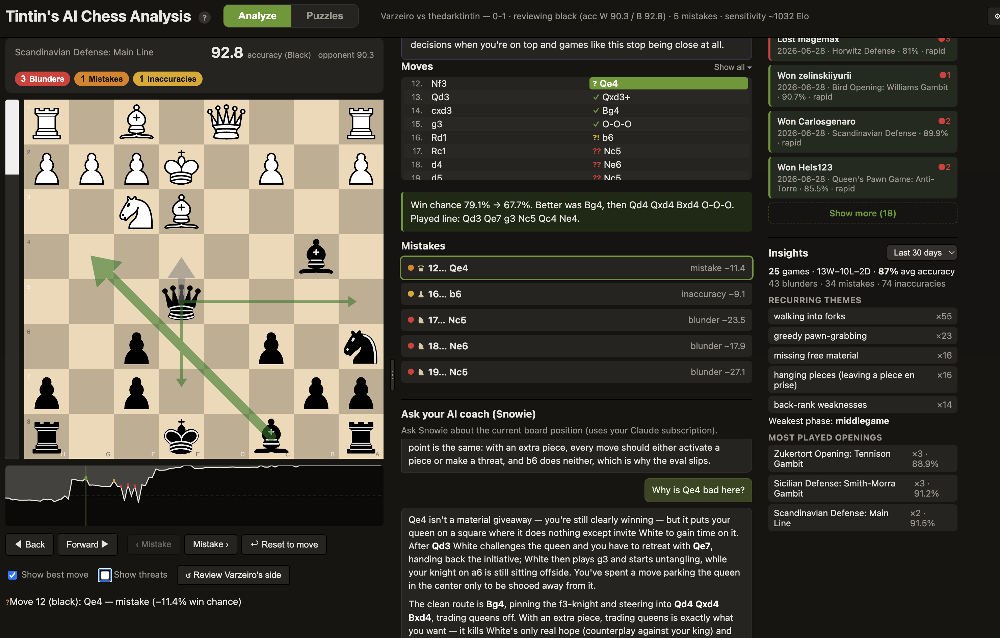
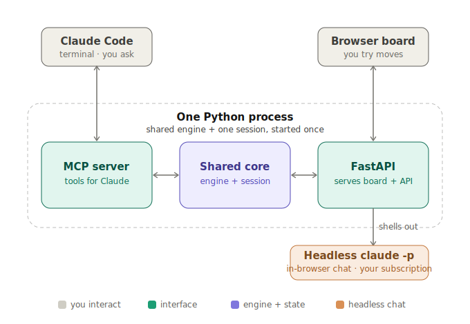
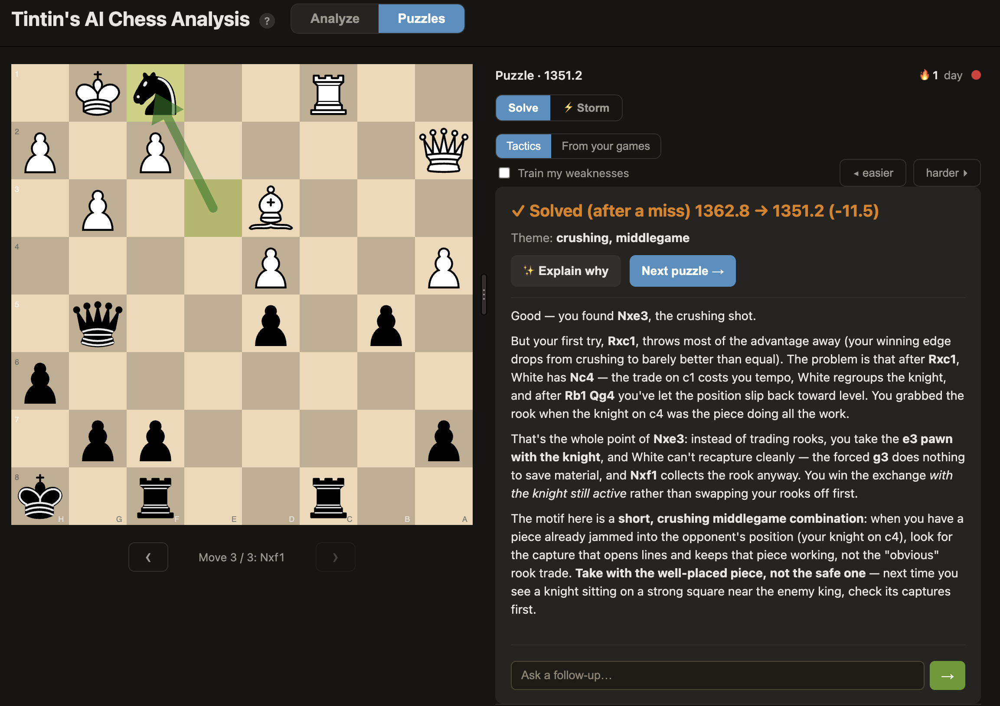

[](https://mseep.ai/app/chess-analysis-mcp-tintins-chess-analysis)

# Chess Review MCP

[](https://github.com/Chess-analysis-mcp/tintins-chess-analysis/actions/workflows/ci.yml)
[](LICENSE)

A chess coach you can actually **talk to**, and one that **doesn't make things up**. Ask why a move
was a mistake or what you should have played, and get a straight answer **in words**, grounded in
real **Stockfish** lines instead of guessed. Under the hood it reviews your game with the engine and
finds exactly where you went wrong; the difference is it then explains it. Works with games from
**anywhere** (Lichess, Chess.com, or any PGN you can paste). Both Lichess and Chess.com games can
be fetched by username, your latest game auto-loads on launch, and new **Chess.com games sync
automatically** into your history. Lichess players get a few extras. It runs two ways: from the **Claude Code
terminal** (as an MCP server) and as an **interactive web board** that share one engine and one
analysis, so they never disagree.

It has **two modes**, side by side in the same board:

- **Analyze** your games: the full-game review described above.
- **Puzzles**: a built-in tactics trainer with a faithful **Glicko-2** rating, a timed **Storm**
  rush, and, uniquely, an AI coach that **teaches the pattern** behind each solution. It can also
  turn your **own past blunders** into practice puzzles. See [Puzzle trainer](#puzzle-trainer).



> **Requires a Claude subscription** *(or a local model)***.** The AI-coach explanations and chat
> (Snowie), the whole "explained in words" part, run on **headless `claude`, using your existing
> Claude subscription** (no API key, no per-token billing). You need the [`claude`
> CLI](https://docs.claude.com/en/docs/claude-code/overview) installed and logged in
> (`claude login`). Prefer to stay fully offline? You can instead point the AI coach at a **local
> model** (Ollama, LM Studio, …) with no Claude account at all; see
> [Run the AI on a local model](#run-the-ai-on-a-local-model-instead-of-claude). Either way, the
> engine review itself (mistake list, eval bar, win graph, arrows) works without any of it.

> **New here? Pick your goal:**
> - 🎯 **I just want to review my games (and train puzzles)** → [get the app](#-i-just-want-to-review-my-games) (download on Mac, or double-click the launcher on Windows/Linux; it sets itself up).
> - 🤖 **I want chess analysis inside Claude Code** → [run the installer](#-i-want-it-inside-claude-code).

---

## Features

- **Full-game review** → an ordered list of your inaccuracies / mistakes / blunders with per-side
  accuracy, using Lichess-style win%-drop thresholds.
- **Explanations in words.** Every flagged move gets a concrete, engine-grounded comment (the
  better move, its line, and how your move gets punished). No guessing: it's built from the engine
  sweep.
- **Interactive board** (chessground): replay each mistake, try your own moves, free-explore down
  any line.
- **Eval bar + Lichess-style win graph** that orient to the side you're reviewing (black-on-bottom
  when you played black). Click the graph or use ← / → to scrub the whole game.
- **Move arrows:** gray = the move you played, green = engine best moves (live **multi-PV** with
  **progressive deepening**, thicker arrow = better move), red = the refutation of a move you try and yellow = threats (toggle **Show threats** or press `t`) to show what the opponent is threatening to play next.
- **Chess.com auto-sync.** If your Chess.com username is set, your latest games will be fetched
 and analyzed (alternatively you can use the ⟳ Sync button on the Chess.com tab).
- **Insights panel.** Recurring themes and stats aggregated across every analyzed game in a chosen
  period (today / past 7 days / past 30 days / all time). Insights include record, average accuracy, your most common mistake motifs, weakest phase, and most-played openings.
- **In-browser AI coach (Snowie).** A "why? / what now?" chat powered by headless `claude -p`
  (your Claude subscription), fed pre-computed engine facts so answers are grounded, not estimated.
- **Cross-game history + coaching profile.** Every reviewed game is saved locally, tagged with
  recurring mistake motifs (hung pieces, missed forks, back-rank, time trouble…), and rolled up
  into a per-player profile. With **"Personalize AI coach with my history"** on (in **⚙ Settings**),
  Claude can draw on your recurring patterns, but only when they actually bear on the position at hand.
- **Puzzle trainer.** A second mode alongside Analyze: solve tactical puzzles with a faithful
  **Glicko-2** rating, a timed **Storm** rush, a **daily streak**, and a **"train my weaknesses"**
  filter that biases selection toward the motifs you miss most. Unlike a bare puzzle site, the AI
  coach **explains the motif** behind each solution, and you can practice **your own past blunders**
  as engine-checked puzzles. See [Puzzle trainer](#puzzle-trainer).
- **Fully offline board.** The board (chessground + chess.js) is **vendored**, not loaded from a
  CDN, so it renders with zero network. Only the optional extras (Lichess/Chess.com fetch, puzzle
  downloads, the AI coach, update checks) reach the network, and each is individually disablable.

---

## How it works

One Python process holds one Stockfish engine pool and one in-memory review session. The MCP server
(for Claude Code) and the FastAPI web server run in that **same process** and share the session, so
the terminal and the board are always looking at the same analysis.

<p align="center">
  
</p>

The browser's "why?" chat is the only part that reaches outside the process: the FastAPI backend
shells out to headless `claude -p` (your subscription). 

---

## Installation

Two ways to use it (the goal-picker links at the top jump straight there). Either way you need
**nothing installed first**, no Python and no Stockfish: the app/installer fetches everything, using
[uv](https://docs.astral.sh/uv/) to download a compatible Python for you.

### 🎯 I just want to review my games

Zero terminal required. Open the app and it brings up a chess board in your browser, ready to
review a game from **any source**: paste or upload a PGN, or, if you
play on **Lichess** or **Chess.com**, just give it your username and it loads your recent games for you.

<a id="review-mac"></a>
**macOS: the app.** Download the zip from the
[Releases page](https://github.com/Chess-analysis-mcp/tintins-chess-analysis/releases). Unzipping it
gives you **`Tintin's AI Chess Analysis.app`**. Drag that into **Applications**, and open it.

- **First open:** it's unsigned, so macOS blocks it once. Double-click it (you'll get a "cannot
  verify" / "blocked" message, click **Done**), then go to **System Settings → Privacy &
  Security**, scroll down to the message about the app, and click **Open Anyway → Open**. You only
  do this once. *(On older macOS you can instead right-click the app → **Open** → **Open**.)*
- The app installs Stockfish + its Python env on first run (needs internet once), then opens the
  board. Its environment and your games/settings live in
  `~/Library/Application Support/Tintin AI Chess Analysis/`, **outside** the app, so your data
  survives updates. Setup problems show in a dialog; logs go to that folder's `launch.log`.

<a id="review-windows-linux"></a>
**Windows / Linux: the double-click launcher.** Three steps, no terminal, no GitHub account needed.

**Step 1: download the project as a ZIP.** On this project's GitHub page, scroll to the **top**,
click the green **`< > Code`** button, and choose **Download ZIP** (see the circled buttons below).

<p align="center">
  
</p>

**Step 2: unzip it.** Double-click the downloaded `.zip` to extract it. You'll get a folder named
something like **`tintins-chess-analysis`**; open it. (On Windows, if it opens "inside" the zip
first, drag the folder out to your Desktop, or right-click the zip → **Extract All**.)

**Step 3: double-click the launcher** inside that folder:

- **Windows:** **`Tintin's AI Chess Analysis.bat`** (if SmartScreen warns: **More info → Run anyway**)
- **Linux:** **`Tintin's AI Chess Analysis.command`**

The **first launch** installs everything (uv + Stockfish + the env) and can take a couple of
minutes; a loading page opens in your browser while it works. Every launch after opens straight to
the board.

**Once the board is open (any platform), load a game from wherever you play**, via the **Games**
panel (☰), which has four tabs:

- **Paste PGN**: works for *everyone*. Paste any PGN, or **Upload .pgn** a file (e.g. a Chess.com
  export of one *or many* games), pick your side, and click **Analyze**; all games land in **My
  games**. This is the universal path, no account of any kind needed.
- **Lichess**: type any handle to fetch that player's recent games,
  and click **"Set as my account"** to make it yours: that drives **My games**, your coaching
  profile, and (in the app) auto-loading your latest game on launch.
- **Chess.com**: Enter any chess.com username to fetch that player's recent games, or press 
  **⟳ Sync new games** to retrieve any new games of your own if your Chess.com username is set.
- **My games**: your previously-analyzed games, to reopen instantly.

Your account/username is set under **⚙ Settings → Your username** (or the Lichess panel's button)
and saved server-side, so it's the same everywhere. **To quit:** just close the browser tab; the
server stops a few seconds later (and the launcher's terminal window closes itself).

### 🤖 I want it inside Claude Code

Run the one-command installer from the repo root, then reload Claude Code; the `chess` MCP server
is already registered in `.mcp.json` (no path editing; it runs via `uv`, which is machine-independent).

```bash
# macOS / Linux
./install.sh
```

```powershell
# Windows (PowerShell)
powershell -ExecutionPolicy Bypass -File .\install.ps1
```

The script is safe to re-run (each step is skipped if already done), prompts for your username, and
finishes with a self-check you can re-run any time:

```bash
uv run python -m server.doctor
```

Then open Claude Code in this folder, paste a PGN, and say *"analyze this game."* You also get the
web board for free; see [Usage](#usage).

<details>
<summary>Advanced: build the macOS .app yourself, or skip uv</summary>

**Build the `.app` from source** (instead of downloading it); produces the same bundle the
Releases page ships:

```bash
./scripts/build_app.sh        # → Tintin's AI Chess Analysis.app (in the repo root)
```

Drag it into **/Applications** and open it (first time, unsigned: double-click, then **System
Settings → Privacy & Security → Open Anyway**). The bundle is
immutable at runtime; its Python env + your data live under
`~/Library/Application Support/Tintin AI Chess Analysis/`. To customise the icon, replace
`assets/app_icon.png` (1024×1024) or drop an `assets/AppIcon.icns`, then rebuild. It still needs the
network on first run and the `claude` CLI for the in-browser chat.

**Skip uv (plain venv / conda).** The project is a standard `pyproject.toml`, so any Python 3.11+
environment works:

```bash
python3.11 -m venv .venv && source .venv/bin/activate   # or conda
pip install -r requirements.txt
```

Then in `.mcp.json` set `"command"` to that interpreter's absolute path (e.g.
`/abs/path/.venv/bin/python`) and `"args"` to `["-m", "server.mcp_server"]`, and run scripts with
that interpreter instead of `uv run python`.

</details>

### Prerequisites (what the app/installer handles for you)

- **Stockfish** is installed for you (via `brew` / `apt` / `winget`, or a direct download of the
  official build) and auto-detected, so no path setup is needed; set `STOCKFISH_PATH` only to force
  a custom build.
- **Internet** is needed for first-time setup only (Python, Stockfish, and the puzzle set). After
  that the board runs fully offline: chessground and chess.js are vendored, with no build step or CDN.
- **The `claude` CLI + a Claude subscription** power the AI coach and chat, on your existing
  subscription (no API key, no per-token billing), or use a
  [local model](#run-the-ai-on-a-local-model-instead-of-claude) instead. The engine review works
  without either; only the plain-English explanations need it.

---

## Usage

### Option A: the web board (no Claude Code required)

The quickest way to review a game. Pass a PGN file and which color you played:

```bash
uv run python scripts/run_web.py example_pgns/game1.pgn white
```

It analyzes the game (~20 to 45s depending on length), opens your browser to
`http://127.0.0.1:8765`, and you can:

1. Click a mistake in the sidebar → the board jumps to that position (gray arrow = the move you
   played) and a written explanation appears.
2. Drag a piece to try a better move → eval bar + a verdict update; a red arrow shows the
   refutation if it's bad.
3. Toggle **Show best move** to see the engine's top move(s) as green arrows that sharpen as the
   search deepens.
4. Scrub the whole game with ← / → or by clicking the win graph; **Back** undoes one ply when
   you're exploring a line.
5. Ask **"why is this bad?"** or **"what should I do here?"** in the chat panel.

The third argument is your color: `white`, `black`, or `auto` (infer from the PGN headers).

**Browse & reopen past games (the Games panel).** A collapsible third column (toggle with the **☰
Games** button) lists games you can open in the board. The panel has four tabs: **My games**
(your previously-analyzed local games), **Lichess**, **Chess.com**, and **Paste PGN**: paste 
a PGN from anywhere, pick which color you played (or leave it on *auto*), and click **Analyze**. 
Click any game (or paste PGN data) and the board opens **immediately**; you can step through 
the moves with ← / → while the engine analysis runs in the background; the eval bar, win graph, 
mistake list, comments, and best-move arrows fill in as soon as it finishes.

**Bulk-analyze a Chess.com export (multiple games at once).** Chess.com lets you download many
games as a single PGN file. In the **Paste PGN** tab, hit **Upload .pgn** (or paste the file's
contents); the app detects all the games, analyzes them one-by-one in the background (showing
"Game *k* of *N*"), and files every one under **My games**. It figures out which handle is *you*
(the player present in all the games) automatically; if it can't, type your username in the
optional box. Once a handle is recognized this way it's remembered, so future games from that
account (Chess.com *or* Lichess) fold into the same history and coaching profile.

### Option B: from the Claude Code terminal (MCP)

With the server registered in `.mcp.json`, open Claude Code in this directory (reload so it picks
up the `chess` server), then:

1. Paste a PGN and say *"analyze this game"* → Claude calls `mcp__chess__analyze_game`, narrates the
   mistakes, and gives you the board URL.
2. Ask *"why was move 4 bad?"* → Claude calls `mcp__chess__get_engine_line` and explains using the
   returned best line + refutation.

Tools exposed: `mcp__chess__analyze_game`, `mcp__chess__fetch_games`, `mcp__chess__fetch_game`,
`mcp__chess__get_engine_line`, `mcp__chess__goto_mistake`, `mcp__chess__get_player_profile` (your
cross-game coaching profile, see below), and the puzzle-trainer pair `mcp__chess__next_puzzle` /
`mcp__chess__solve_puzzle` (drive the same puzzle session as the board; see
[Puzzle trainer](#puzzle-trainer)).

#### Example (terminal)

> **You:** *(paste PGN)* analyze this as white
>
> **Claude:** Your accuracy: 92.7%, a clean game. 3 flagged moments…
> 1. **Move 4: Nf3** was the big one. After 3…Nd4?? the crushing reply was **4. c3!**, kicking the
>    knight with nowhere to go (~+3.7). Instead 4. Nf3 invited 4…Nxf3+ and dropped to roughly equal.
> 2. **Move 10: Qf3** (a mistake, but you were already winning)…
>
> 📊 Open the interactive board: http://127.0.0.1:8765

### Snowie: the in-browser AI coach

**Snowie** is the chat panel: it answers position-aware questions using your Claude subscription.
Each question is handed the **current board** (for *"what should I do here?"*) and the **move in
question** (for *"why is this bad?"*), each with pre-computed Stockfish facts, so Snowie reasons
from real lines. Follow-up questions remember the conversation.

### Run the AI on a local model (instead of Claude)

The chat and AI coach can run on a model **on your own machine** instead of your Claude subscription,
with no Claude account or `claude` CLI at all. It works with any local server exposing an
OpenAI-compatible `/v1/chat/completions` endpoint ([Ollama](https://ollama.com), LM Studio,
llama.cpp, a [LiteLLM](https://github.com/BerriAI/litellm) proxy, …).

- **Ollama (one click):** pull a model (`ollama pull qwen2.5-coder`), then in **⚙ Settings → Advanced
  → Local AI model** click **Detect Ollama**, pick a model, and **Save**.
- **Anything else:** in the same place, fill in the server **URL** (e.g. `http://localhost:1234/v1`
  for LM Studio) and the **Model** name. Clear the field to switch back to Claude.

Quality depends on the local model, and the Stockfish analysis stays local either way. The terminal
MCP workflow still uses Claude; this covers the in-browser chat and coach summary.

---

## Puzzle trainer

A **tactics trainer** built into the same board. Flip the header switch from **Analyze** to
**Puzzles** and the whole workspace collapses to a calm, board-first solve layout: one big board,
one clear prompt, and a slim rail.



- **Rated tactics with real Glicko-2.** Puzzles come from the CC0 **Lichess puzzle database**,
  sliced into rating-banded, theme-stratified shards. Each solve or miss moves your rating with a
  faithful **Glicko-2** update (the same system Lichess uses), and a quiet rating curve tracks your
  progress. A per-user seed means two players of the same rating get different, non-repeating
  streams from identical files.
- **The AI coach teaches the pattern.** Press **✨ Explain why** and the coach names the motif and
  walks the forced line, grounded in the puzzle's verified solution and its theme tags. On a miss it
  first shows concretely **why your move failed** (the engine refutation), then teaches the winning
  idea. This is the part a bare puzzle site can't do.
- **"From your games" mistake puzzles.** A second source resurfaces positions where **you actually
  blundered** in a past game as practice. These are engine-checked (any move that holds the eval is
  accepted, so positional spots allow several answers), badged with the matchup and date, and carry
  a **"replay in the full game"** link back to the review board. They stay **unrated** so your own
  losses never pollute the Glicko score, and space themselves out Anki-style as you get them right.
- **Train my weaknesses.** A toggle that biases puzzle selection toward the motifs your coaching
  profile says you miss most (forks, back-rank, loose conversion…), closing the loop between the
  games you played and the puzzles you drill.
- **Storm (timed rush).** A **⚡ Storm** sub-mode: solve as many as you can before the clock runs
  out, with a combo counter, bonus time for streaks, and a saved high score. Unrated by design, so
  it never touches your Glicko rating.
- **Flow-state extras.** A **daily streak** (consecutive days you've solved at least one), optional
  **auto-advance** to the next puzzle after a solve, and green/yellow/red square-blink feedback.
  All configurable under **⚙ Settings → Puzzles**.

Everything degrades gracefully: the first puzzle serves instantly from a small vendored offline
baseline while the full set (~16 MB) downloads in the background; with no engine, only the static
tactics track shows; with no `claude`/local model, you still solve, just without the written
explanation. Puzzles are drivable from Claude Code too via the `mcp__chess__next_puzzle` /
`mcp__chess__solve_puzzle` tools, which share the same session as the board.

---

## Game history & coaching profile

Every game you review is **saved locally** so the tool can learn your recurring weaknesses over
time. This is best-effort and fully local: history can never break a review, and nothing leaves
your machine (the chat is the only outbound call, and your profile is only attached to it when you
opt in).

- **What's saved.** One compact record per reviewed game, in a per-user app-data folder shared by
  Claude Code and the app. Re-analyzing a game supersedes the old record rather than duplicating it.
- **Mistake motifs.** Each flagged mistake is tagged with engine-free heuristics (hung pieces,
  missed forks, back-rank, time trouble, …) that build up your profile.
- **Game-mode aware.** Games are tagged bullet / blitz / rapid / classical, and the flagging
  thresholds scale by mode and by your skill level, so a bullet blunder is judged more leniently
  than a classical one.
- **Coaching profile.** A hybrid of a `recent` sliding window (so fixed weaknesses fade) and a
  `lifetime` view, with an "improving / slipping" trend. Available in the terminal via
  `mcp__chess__get_player_profile`, or fed to the board's chat.
- **Personalized chat.** The **"Personalize AI coach with my history"** setting (on by default) lets
  Claude connect the position to your recurring patterns, subtly, only when it sharpens the answer.

### Who is "you"? (identity & aliases)

History is keyed to a canonical player, not a username, so games across your Lichess and Chess.com
accounts merge into one profile. Set your handles in ⚙ Settings (or `CHESS_USERNAME` / `CHESS_ALIASES`)
and they all fold into one player, which also drives `player="auto"` side detection. To turn history
off entirely, set `CHESS_HISTORY=0`.

---

## Configuration

Most people never need to configure anything. The common options live in the in-app **⚙ Settings**
panel (no file editing): your **username** and other accounts, an optional **Lichess token**, your
**skill level**, and, under *Advanced*, the **Stockfish path**, a **local AI model**, and the puzzle
toggles. Saving applies immediately, to both the standalone app and the Claude Code workflow (they
share one `settings.json`).

Everything is also settable via environment variables (`settings.json` wins where both are set). The
handful worth knowing:

| Variable | Purpose |
| --- | --- |
| `STOCKFISH_PATH` | Force a specific Stockfish binary (otherwise auto-detected). |
| `CHESS_USERNAME` / `CHESS_ALIASES` | Your handle(s), for side-detection and merging history across accounts. |
| `CHESS_LOCAL_LLM_BASE_URL` / `CHESS_LOCAL_LLM_MODEL` | Run the AI on a [local model](#run-the-ai-on-a-local-model-instead-of-claude) instead of Claude. |
| `CHESS_HISTORY=0` / `CHESS_PUZZLES=0` | Turn off game history, or the puzzle trainer. |

The full list (analysis depths, ports, cache sizes, profile windows, data directory, puzzle knobs, …)
lives in `server/config.py`.

---

## Running the tests

```bash
uv sync --extra dev          # pulls in pytest (one time)
uv run python -m pytest
```

The suite is all fast unit/mock tests with no Stockfish, no network, and no `claude` CLI (the
engine, the Lichess API, and the chat are mocked), so it runs in well under a second and never
spends Agent-SDK credit. It also runs on every push / PR via GitHub Actions (`.github/workflows/ci.yml`).

---

## Project layout

```
server/
  config.py          # all tunables (env-driven)
  core/              # engine pool, evaluation math, game analysis, session, engine_line,
                     #   history (game records + motifs + coaching profile), lifecycle watchdog,
                     #   puzzles (Glicko-2 rating, shard fetch, mistake puzzles, storm)
  mcp_server.py      # MCP tools; boots the web server in a background thread
  claude_bridge.py   # headless `claude -p` for the chat + puzzle coach (subscription)
  web/               # FastAPI app + board/chat/puzzle routes + uvicorn runner
frontend/            # no-build single page (index.html + main.js + styles.css, vendored chessground)
scripts/             # run_web.py (standalone board), validation/smoke scripts
example_pgns/        # sample games (game1.pgn White, game2.pgn Black)
tests/               # pytest suite
```

---

## Limitations / notes

- The web board is **no-build and vendored** (chessground & chess.js ship with it), so once set up
  it renders fully offline; only first-time setup needs the network.
- In-browser chat requires the `claude` CLI installed and logged in, and draws from your Agent SDK
  credit; the terminal path is the zero-extra-cost fallback. (Or point it at a
  [local model](#run-the-ai-on-a-local-model-instead-of-claude) to skip Claude entirely.)
- Engine analysis is fixed-depth and cached for reproducibility, so evals can differ slightly from
  Lichess near classification boundaries. That's expected.

---

## FAQ

### How do I install the `claude` CLI, and how is it different from the Claude app?

The `claude` CLI (Claude Code) is a separate program that runs in your computer's **terminal**. It
is not the Claude desktop app or the claude.ai website, but it signs in with the **same Claude
subscription**, so there's no extra account, no API key, and no per-token bill. This tool uses the
CLI behind the scenes to write the plain-English coaching, which is why you need it installed and
logged in.

<details>
<summary><strong>Show installation steps</strong></summary>

<br>

Open a terminal and install Claude Code with one of these (the native install is recommended):

```bash
# macOS / Linux / WSL
curl -fsSL https://claude.ai/install.sh | bash

# Windows (PowerShell)
irm https://claude.ai/install.ps1 | iex
```

Or use a package manager: `brew install --cask claude-code` (macOS) or
`winget install Anthropic.ClaudeCode` (Windows).

Then run `claude` once and follow the prompt to log in with your Claude subscription. After that,
restart the app (or reload Claude Code) and the AI coach will work. Full details are in the
[Claude Code docs](https://docs.claude.com/en/docs/claude-code/overview).

</details>

> The engine review itself (the mistake list, eval bar, win graph, and arrows) works without the
> CLI. You only need it for the conversational coaching and the AI summaries.

---

## License & credits

Created and developed by **[Dmitri Demler](https://github.com/DimaPdemler)**.

This project is licensed under the **MIT License**. See [`LICENSE`](LICENSE).

With thanks to contributors:

- **[riskydissonance](https://github.com/riskydissonance)** and **[Leland Olney](https://github.com/JohnnyPrimus)**: Chess.com API integration.

It also stands on the shoulders of others:

- **[Stockfish](https://stockfishchess.org/)**: the chess engine doing the actual analysis.
  Stockfish is licensed under the **GNU GPL v3**; this project invokes it as a separate binary and
  does not include or modify its source. The app/launcher downloads the official Stockfish build
  when no system install is found.
- **[python-chess](https://python-chess.readthedocs.io/)** (GPL v3): PGN parsing, move
  generation, and board logic.
- **[chessground](https://github.com/lichess-org/chessground)** & **[chess.js](https://github.com/jhlywa/chess.js)**: the interactive board UI (vendored under `frontend/vendor/`, no CDN).
- **[Lichess puzzle database](https://database.lichess.org/#puzzles)** (CC0): the tactics puzzles behind the trainer.
- **Opening names** come from the **[Lichess `chess-openings`](https://github.com/lichess-org/chess-openings)** ECO dataset (CC0), vendored in `server/data/eco/`.
- **[FastAPI](https://fastapi.tiangolo.com/)**, **[uvicorn](https://www.uvicorn.org/)**,
  **[Pydantic](https://docs.pydantic.dev/)**, and the **[MCP](https://modelcontextprotocol.io/)**
  Python SDK power the server.

Trademarks (Lichess, Chess.com, Claude, Anthropic) belong to their respective owners; this is an
independent project not affiliated with any of them.
